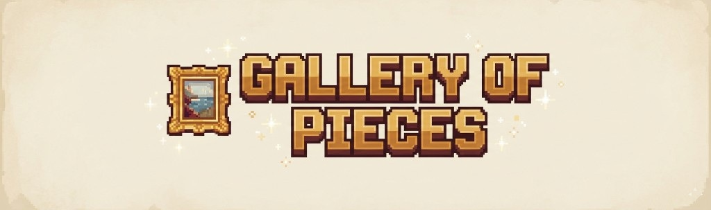
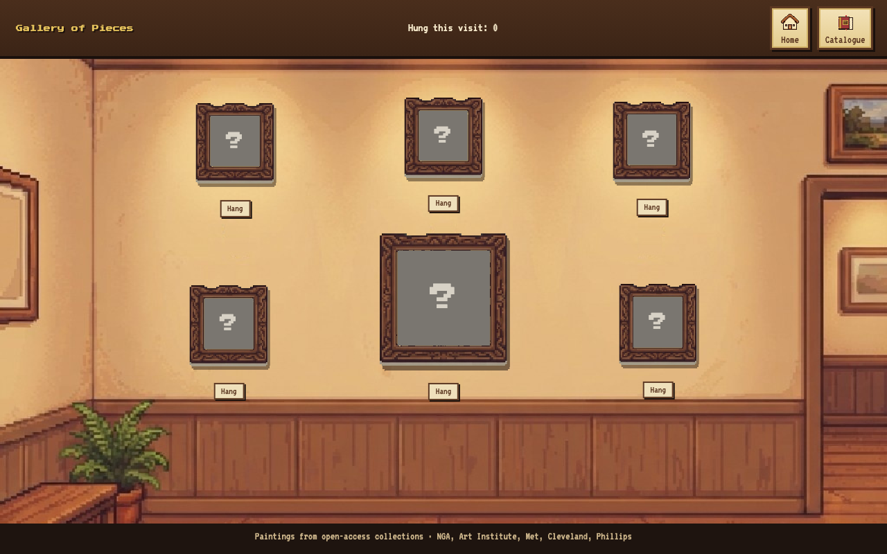

# Gallery of Pieces

<p align="center">
  
</p>

You are an art conservator. The gallery is yours: a small room with warm lights, wooden panelling, and empty frames waiting on the wall. Famous paintings arrive in pieces. Your work is to restore them, hang them, and let the room slowly fill.

A cozy 16-bit jigsaw in the browser. No accounts, no downloads — just a catalogue of public-domain masterworks and a quiet afternoon among the frames.

<p align="center">
  
</p>

## How to play

1. Step through the doorway and into the gallery.
2. Open the **Catalogue**. Choose an artist, then a painting to restore.
3. Hang it on a hook. One frame is the centrepiece; five companions sit around it.
4. Piece the work back together on a **6×6** board.
   - **Solo** — unhurried, with gentle hints when a piece is close.
   - **Multiplayer** — pass the device. Blue vs Red. A correct piece keeps your turn; a miss hands it over.
5. When the last shard locks, the painting is whole again. Play another, or return and see it glowing on your wall.

The hanging lasts for this visit only. Leave or refresh, and the gallery is empty once more — ready for a new conservation day.

## The collection

Sixty open-access works, six from each artist:

| Artist | In the gallery |
| --- | --- |
| Vincent van Gogh | Self-portraits, orchards, Provence |
| Claude Monet | Gardens, cathedrals, the Seine |
| Gustav Klimt | Gold, portraits, forests |
| Pablo Picasso | Blue Period and Rose Period (US public domain) |
| James McNeill Whistler | Nocturnes and arrangements |
| Mary Cassatt | Mothers, children, Paris interiors |
| Katsushika Hokusai | Thirty-six Views of Mount Fuji |
| Piet Mondrian | Trees to grids (published by 1930) |
| Paul Klee | Colour and line (published by 1930) |
| Jan Toorop | Symbolism and Art Nouveau |

Images come from open-access collections at the **National Gallery of Art**, the **Art Institute of Chicago**, the **Metropolitan Museum of Art**, the **Cleveland Museum of Art**, and the **Phillips Collection**.

## Play locally

This is a static site. From the project folder:

```bash
python3 -m http.server 8765
```

Then open [http://127.0.0.1:8765/](http://127.0.0.1:8765/).

## Built with

Vanilla HTML, CSS, and JavaScript. Paintings are pixelated in the browser. Nothing is stored after you leave.

Handle them gently. They have already survived a long journey to your wall.
